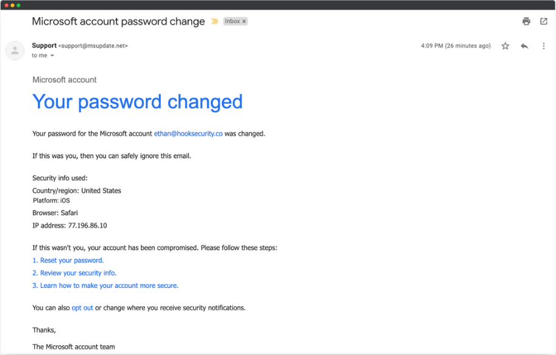

# 📧 Phishing Email Analysis Report

## 1. Email Overview
- **Subject:** Microsoft account password change
- **Sender Address:** support@msupdate.net (suspicious domain, not official Microsoft)
- **Received Time:** 4:09 PM (local time)
- **Attachment/Links:** Reset password & security info links included

---

## 2. Phishing Indicators Found

### 🔹 2.1 Suspicious Sender Address
- Email claims to be from Microsoft but domain is **msupdate.net**, not microsoft.com.
- This indicates possible spoofing.

---

### 🔹 2.2 Urgent/Threatening Language
- Phrases like:
  - "If this wasn't you, your account has been compromised."
  - "Please follow these steps."
- Uses **fear tactics** to force quick action.

---

### 🔹 2.3 Suspicious Links
- Displayed links: "Reset your password", "Review your security info".
- Actual destination likely differs (needs header/link inspection).

---

### 🔹 2.4 Email Header Analysis
- Expected From: *@microsoft.com*
- Actual From: *@msupdate.net*
- SPF/DKIM results would likely fail on header analysis.

---

## 3. Conclusion
The analyzed email contains multiple phishing indicators:
- Spoofed sender domain (msupdate.net)
- Urgent and fear-based language
- Suspicious password reset links
- Likely header authentication failures

✅ This email is **confirmed phishing** and should be reported to the security team.

---

## 4. Recommendations
- Never click on suspicious links.
- Verify sender’s domain carefully.
- Use header analysis tools to confirm legitimacy.
- Report phishing attempts to IT/security teams.

---
